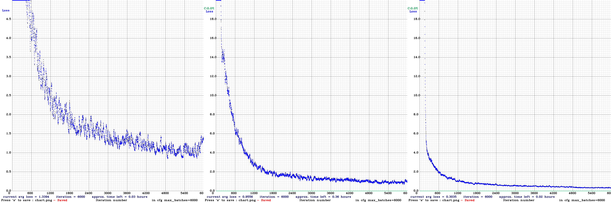

# YOLO Mask Detection

Mask detection for real world images based on the [darknet](https://pjreddie.com/darknet/yolo/) framework and it's [YOLOv3 Tiny PRN architecture](https://github.com/WongKinYiu/PartialResidualNetworks). 

### Dataset
The dataset for this pre-trained network is provided by [VictorLin000](https://github.com/VictorLin000/YOLOv3_mask_detect) and contains 678 images of people with and without masks. In total there are 2 different classes annotated:

* `NONE` - No mask at all.
* `GOOD` - Mask coveres the essential parts.

### Training
The model has been trained on a 1080TI for about 2h over 6000 iteration with a batch size of 64 and 16 subdivisons (PRN & yolov4-tiny), 64 / 64 for yolov4.



*YOLOv3-tiny-prn / YOLOv4 / YOLOv4-tiny*

[dataset](https://drive.google.com/drive/folders/1aAXDTl5kMPKAHE08WKGP2PifIdc21-ZG)

### Inferencing
The weights have been trained on an image size 416x416 (PRN & tiny) / 608x608 (YOLOv4). It is also possible to inference it with a lower model size to increase the speed. A good performance / accuracy mix on CPUs has been discovered by using an image size of 128x128.

The model itself is fully compatible with the opencv dnn module and just ready to use.

### Demo
There are either a python or a processing (java) demo you can run to test out your model directly with a webcam.

#### Python
To run the demo, please first install all the dependencies (`requirements.txt`) into a virtual environment and download the model and weights into the model folder (or run the shell script).

Then run the following command to start a webcam detector with Yolov3-Tiny-PRN:

```python
# with python 3
python demo_webcam.py -n prn

# yolov4
python demo_webcam.py -s 608

# yolov4-tiny
python demo_webcam.-n tiny
```

#### Processing
For artists and makers there is also a [basic example](https://github.com/cansik/yolo-mask-detection/blob/main/MaskP5/MaskP5.pde) on how to use this network in [Processing](https://processing.org/). The sketch itself is based on the following libraries:

* [Video Library 2.0](https://github.com/processing/processing-video)
* [Deep Vision Library](https://github.com/cansik/deep-vision-processing)
